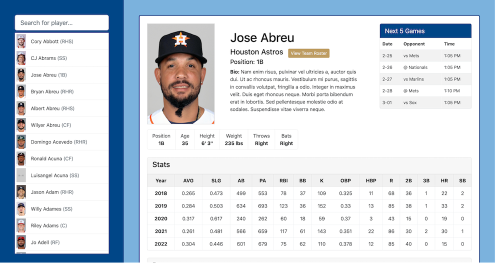
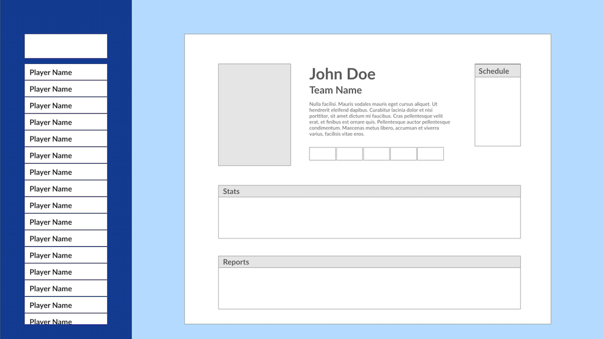

# Royals Knowledge Base  

Users can search and browse over 1000 MLB players. View players stats, reports, upcoming schedule, see full roster of teammates, and more. Built with:  
  
- Vue 3  
- Vite 4  
- Bootstrap 5  
- Axios (latest)
- Adobe XD




Based on rough layout designed on Adobe XD




- Live Site URL: [https://atmkcmo.github.io/royals-knowledgebase/](https://atmkcmo.github.io/royals-knowledgebase/)

## Project Setup

```sh
npm install
```

### Compile and Hot-Reload for Development

```sh
npm run dev
```

### Compile and Minify for Production

```sh
npm run build
```

### Preview for Production

```sh
npm run preview
```
